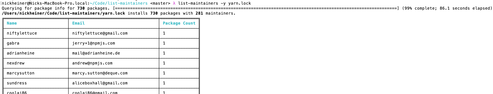

# `list-maintainers`: See who's behind your `node_modules`
Curious who you're letting run code on your machine when you run `yarn install`? Use this tool to see a list of all maintainers of all your packages.



Fun trivia: as of this writing, a newly instantiated `create-react-app` project has `1609` packages from `549` maintainers.

## Install
```
yarn global add list-maintainers

# Or
npm install -g list-maintainers

# Or, install and use all in one go:
npx list-maintainers --yarn-lockfile path/to/lockfile
```

The supported version of Node is the one listed in [.nvmrc](./.nvmrc).

## Usage
```
$ list-maintainers --yarn-lockfile path/to/lockfile
```

See `list-maintainers --help` for more detail.

## Why does this exist?
After the event-stream incident, I started thinking more seriously about who I'm granting remote code execution to. Like everyone else, I have a ton of projects with many contributors, because npm is like Willy Wonka's chocolate factory to me.

I'd like more visibility into the people behind my `node_modules`, so I made this tool.

## Limitations
**npm is not supported.** But I'm happy to add it if someone would like it. Or you could send a PR yourself – the code would be simple.

**There is limited information about the authors.** I didn't list the packages that each author contributes because there's no line-wrapping in the ASCII table generator I'm using. And more broadly, I'd like to be able to surface trustworthiness indicators like account age, how many other popular packages that maintainer contributes to, etc. I could scrape and hack at npm to get some of this data, but ultimately, npm, Inc has direct access to it. It would be far more efficient for them to either expose an API or provide their own functionality.

## Dev Notes
`yarn info --json` provides a `maintainers` entry like:

```json
[
  {
    "name": "isaacs",
    "email": "i@izs.me"
  }
]
```

whereas `npm`'s is:

```json
[
  "isaacs <i@izs.me>"
]
```

If you request `name@version`, the `maintainers` field is specific to that version. There could be some interesting questions about how to handle maintainers who have left a project but their code remains. They would not show up in the `maintainers` entry.

`yarn owner list` also exists. But I think it's the same as `info maintainers`, and it's less ergonomic to use because it streams results instead of returning them all at once.

### TODO
* Support combining multiple lock files. This can be useful you want to get a sense of exposure across multiple projects, but don't want authors duplicated.
* If an author only has one package, list it. Or for any author, list the most (or least?) popular package they have in your `node_modules`.
